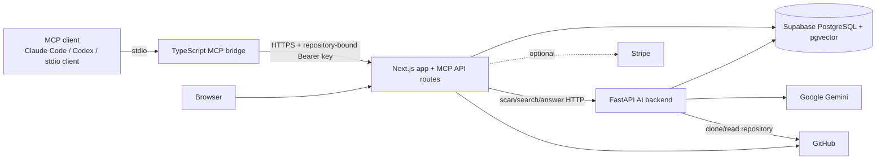

# Context Compiler

Context Compiler turns a GitHub repository into a searchable, repository-bound context service for humans and MCP-compatible AI clients. It clones and chunks source code, creates Gemini embeddings in PostgreSQL/pgvector, and exposes ranked code search, grounded Q&A, context packs, file context, and feature-flow tracing through a web UI and a local read-only MCP stdio bridge.

> **Project status:** self-hosted pre-release (`0.1.0`). It is a multi-service application, not a standalone local code-search binary. Scanning requires Supabase/PostgreSQL, a GitHub integration, the Python AI service, and Gemini credentials.

## Verified capabilities

- Hybrid semantic and lexical repository search with language, category, and path filters.
- Grounded repository answers with citations and a non-generative fallback.
- Prompt-ready context packs and indexed file chunk retrieval.
- Retrieval-based feature-flow/read-order suggestions.
- Incremental GitHub scans, GitHub App reconciliation/webhooks, repository-bound MCP API keys, workspaces, saved carts/answers, notifications, and optional Stripe billing.
- One MCP transport: local **stdio**, forwarding authenticated requests to the Next.js application.

Context Compiler currently registers five MCP tools. It registers no MCP resources or prompts. See the complete [MCP reference](docs/MCP_REFERENCE.md).

## Architecture



## Prerequisites

- Bun 1.x (the lockfile and scripts use Bun; CI should pin a tested release).
- Node-compatible runtime required by Next.js 16 (Node 20.9+ when not invoking through Bun).
- Python 3.11+ for the AI service.
- PostgreSQL with `pgvector` (the intended hosted provider is Supabase).
- GitHub OAuth and/or a GitHub App for login and repository access.
- A Google Gemini API key for embeddings. Stripe is optional unless billing routes are used.

## Five-minute MCP quick start

This path assumes an administrator has already deployed Context Compiler and scanned a repository.

1. Install the bridge dependencies:
   ```bash
   git clone https://github.com/TahubCS/Context-Compiler.git
   cd Context-Compiler
   bun install --frozen-lockfile
   ```
2. In the repository page, open **MCP**, create a repository-bound key, and copy it once.
3. Diagnose authentication without exposing the key:
   ```bash
   CONTEXT_COMPILER_BASE_URL="https://your-context-compiler.example" \
   CONTEXT_COMPILER_MCP_KEY="ccmcp_REPLACE_ME" \
   bun run mcp:doctor
   ```
   Expected output resembles `OK: authenticated to owner/repository; scan status: completed`.
4. Add one of the [verified stdio configuration shapes](examples/mcp-clients.md), restart the client, and ask it to call `search_codebase` with `{"query":"authentication entrypoint"}`.

The response contains repository metadata, a best match, related files, grouped matches, and structured content. Exact files and scores vary with the bound repository and its latest scan.

## Self-hosted installation

```bash
bun install --frozen-lockfile
cp .env.example .env.local
bunx prisma generate
bunx prisma db push       # development database; review migrations for production
python -m venv ai-backend/.venv
ai-backend/.venv/bin/pip install -r ai-backend/requirements.txt
```

Fill placeholders in `.env.local`; never paste or commit a complete environment file. The variable inventory is in [`.env.example`](.env.example). At minimum, the web app needs database/Supabase settings. Repository import needs GitHub settings, scanning needs `AI_BACKEND_URL`, `AI_CALLBACK_SECRET`, and the AI service settings, and MCP key issuance needs `MCP_API_KEY_SECRET`.

Generate independent high-entropy secrets for callback, webhook, encryption, and MCP-key encryption purposes. `GITHUB_TOKEN_ENCRYPTION_KEY` and `MCP_API_KEY_SECRET` must meet the 32-byte base64 requirements enforced by their implementations.

### Development

Terminal 1:
```bash
bun run dev
```

Terminal 2:
```bash
cd ai-backend
../ai-backend/.venv/bin/uvicorn main:app --host 127.0.0.1 --port 8000 --reload
```

Check the AI process with `curl --fail http://127.0.0.1:8000/health`. Then sign in, connect GitHub, import and scan a repository, wait for completion, and create its MCP key.

### Production

```bash
bun run build
bun run start
cd ai-backend && .venv/bin/uvicorn main:app --host 0.0.0.0 --port 8000
```

Run database migrations through a reviewed deployment process before the application. Put both services behind TLS, restrict the AI backend to the web application where possible, and configure the GitHub webhook at `/api/github-app/webhook`. The included Dockerfile packages only the Python service; deployment of the Next.js application and database remains operator-managed.

## MCP operation

```bash
bun run mcp:stdio --help
bun run mcp:doctor
bun run mcp:stdio
```

`mcp:stdio` is normally spawned by a client, not typed interactively. It reserves stdout for MCP protocol frames and sends startup diagnostics to stderr. Required client-process variables are `CONTEXT_COMPILER_BASE_URL` and `CONTEXT_COMPILER_MCP_KEY`; optional `CONTEXT_COMPILER_TIMEOUT_MS` defaults to 15000 and accepts 1000–120000.

## Configuration and security

- Treat repository keys, Supabase service roles, database URLs, GitHub tokens/private keys, Gemini keys, Stripe secrets, and callback/webhook secrets as credentials.
- Store them in platform secret storage or local untracked environment files. Rotate a key immediately if it enters logs, shell history, screenshots, or version control.
- MCP keys are repository-bound and read-only at the MCP tool layer. Create separate named keys per client and revoke unused keys.
- Do not put credentials in `CONTEXT_COMPILER_BASE_URL`; the bridge rejects credential-bearing URLs. Keep TLS verification enabled and use HTTPS outside local development.
- Grant the GitHub App only the repository access and permissions needed for content indexing and webhook events.
- The scanner sends a short-lived repository credential to the private AI service to clone the repository. Secure that network path and do not expose the AI service publicly without additional controls.

## Troubleshooting

| Symptom | Cause / action |
|---|---|
| `Missing CONTEXT_COMPILER_BASE_URL` or `...MCP_KEY` | Add both variables to the MCP client's spawned-process environment, not only your interactive shell. |
| `Unauthorized` | The key is malformed, revoked, or points at another deployment. Create a new key for the repository and confirm the base URL. |
| Non-JSON response | The base URL likely points to a proxy error page or the Python backend. It must be the Next.js app origin. |
| Request timeout / connection failure | Run `bun run mcp:doctor`, check DNS/TLS and application health, then raise the timeout only if the service is healthy but slow. |
| Client shows disconnected | Use an absolute repository path, run `bun install`, check `bun run mcp:stdio --help`, and restart the client. Do not expect a remote SSE/HTTP MCP endpoint. |
| Search has no results / file not found | Complete a repository scan; file context comes from the index and can lag the live branch. |
| Scan fails | Verify GitHub installation access, Gemini key/quota, AI backend connectivity, callback secret equality, database/pgvector, and scan-job diagnostics. |
| MCP key creation says storage/config is unavailable | Apply current Prisma migrations/schema and provide a valid `MCP_API_KEY_SECRET`. |
| Build fails on environment validation | Compare variable names with `.env.example`; optional integrations may still have routes that require their secrets when invoked. |

## Validation and contribution

```bash
bun run lint
bun run typecheck
bun test
bun run build
python -m compileall -q ai-backend
```

For Python dependency-isolated work, create the virtual environment above and add focused tests before changing scanning or retrieval. Keep migrations additive, never commit secrets or generated Prisma output, and update [the MCP reference](docs/MCP_REFERENCE.md) whenever tool schemas change. Open a focused pull request explaining behavior, tests, migration impact, and operational changes.

## Current limitations and follow-up work

- MCP is stdio-only and requires a local checkout plus access to a separately hosted web app; there is no Streamable HTTP/SSE transport or packaged executable.
- The MCP surface has tools only—no resources, prompts, subscriptions, or write operations.
- Full self-hosting is operationally involved and lacks a single compose file, automated environment doctor for every web/AI integration, and end-to-end tests with ephemeral PostgreSQL/pgvector.
- Indexed content can be stale until a scan completes. Feature-flow and Q&A outputs are retrieval/model-assisted and should be verified before edits.
- External integration tests require credentials and live services and are not safe to run by default.
- Billing exists in code but is optional; production pricing/entitlements should be reviewed by each operator rather than inferred from this README.

## License

The repository currently contains no tracked license file. Treat the code as unlicensed until the owner adds one; the previous README's MIT claim was not verifiable from the repository.
